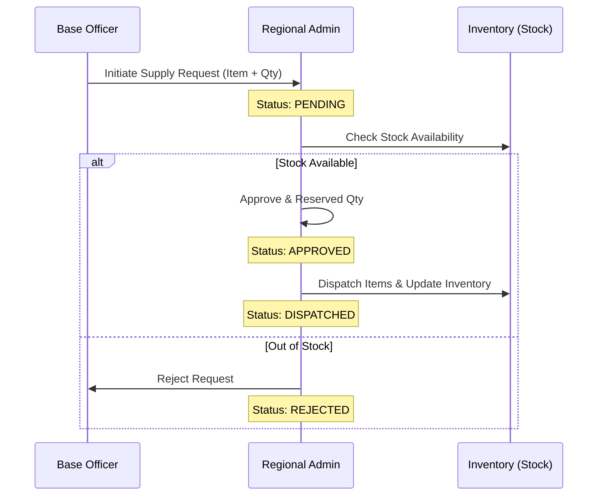
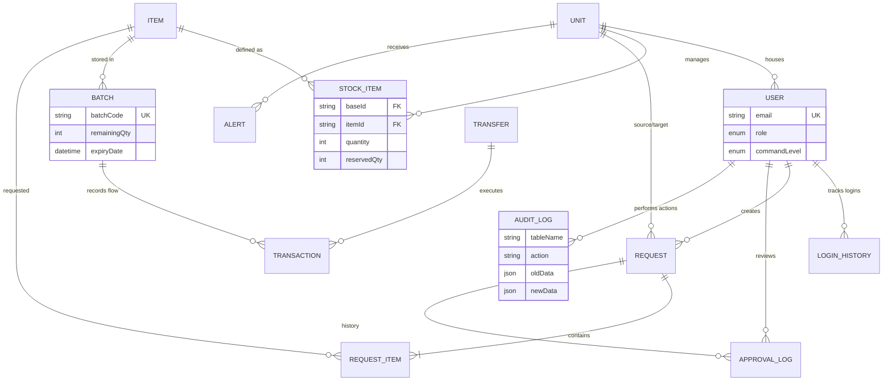

# ⚔️ MIMS | Military Inventory Management System

[](https://nextjs.org/)
[](https://www.prisma.io/)
[](https://tailwindcss.com/)
[](https://www.postgresql.org/)
[](https://www.typescriptlang.org/)

> **MIMS** is a comprehensive, enterprise-grade supply chain and orchestration platform designed for multi-tier military logistics. From Central Command to frontline local bases, MIMS ensures resource availability, transparency, and accountability.

---

## 🚀 Key Modules & Technical Depth

### 🏛️ Strategic Command (Hierarchical Units)
MIMS utilizes a recursive tree structure to model the military command chain.
- **Recursive Hierarchy**: Units can have parent and children units (e.g., Central Command -> Regional Depot -> Army Base).
- **Command Levels**: Integrated logic for `CENTRAL_COMMAND`, `REGIONAL_DEPOT`, and `ARMY_BASE`.

### 🚛 Logistics Engine (Supply Requests)
A robust workflow for requesting and transferring resources between units.
- **Supply Requests**: Units can request items from parent or peer units.
- **Multi-stage Approval**: Requests move through `PENDING`, `APPROVED`, `DISPATCHED`, and `REJECTED` states.
- **Emergency Flag**: Prioritization of critical supply requests.

### 🔫 Arsenal Control (Inventory & Batches)
Precision tracking of items with granular batch management.
- **Stock Tracking**: Real-time quantity tracking at the unit level with `reservedQty` logic.
- **Batch Management**: Tracking `manufactureDate`, `expiryDate`, and `maintenanceDueDate` for every batch.
- **Automated Alerts**: Low stock and upcoming expiry notifications based on `minThreshold`.

### 📜 Audit & Compliance
Full-spectrum accountability for every action taken in the system.
- **Audit Logs**: Deep tracking of `ActionType` (CREATE, UPDATE, DELETE, TRANSFER) with `oldData` and `newData` JSON snapshots.
- **Login History**: Tracking IP addresses, User Agents, and failed login attempts to prevent unauthorized access.

---

## 🔄 Supply Request Workflow



---

## 📊 Detailed Entity Relationship Diagram (ERD)



---

## 🛠️ Tech Stack & Security

- **Framework**: [Next.js 15](https://nextjs.org/) (App Router & Server Actions)
- **Database**: [PostgreSQL](https://www.postgresql.org/) with [Prisma ORM](https://www.prisma.io/)
- **Authentication**: [NextAuth.js](https://next-auth.js.org/) with custom credentials provider.
- **Asset Management**: [UploadThing](https://uploadthing.com/) for profile avatars and manual documents.
- **Transactional Integrity**: Every stock movement is logged as a `Transaction` tied to a specific `Batch` or `Transfer`.
- **RBAC**: Strict Role-Based Access Control enforcing command level boundaries.

---

## 📦 Project Structure

```text
mims/
├── prisma/               # Schema Design & Seed Data
├── src/
│   ├── app/              # Next.js Routes (Auth, Dashboard, Inventory)
│   ├── features/         # Modular Business Logic
│   │   ├── inventory/    # Stock & Batch management
│   │   ├── requests/     # Supply Chain workflows
│   │   └── transfers/    # Peer-to-peer asset movement
│   ├── shared/           # Cross-cutting concerns
│   │   ├── components/   # UI System (Shadcn-like)
│   │   └── lib/          # Database & Utility singletons
```

---

## 🏁 Getting Started

### 1. Prerequisites
- Node.js 18+
- PostgreSQL Instance

### 2. Installation
```bash
git clone https://github.com/Vishaldubey2210/DBMS_Project.git
npm install
```

### 3. Environment Configuration
Create a `.env` file:
```env
DATABASE_URL="postgresql://..."
NEXTAUTH_SECRET="..."
RESEND_API_KEY="..."
```

### 4. Database Sync
```bash
npx prisma generate
npx prisma db push
npm run seed
```

---

Built with ❤️ for **DBMS Final Project**.  
*Military Grade Inventory at your fingertips.*
